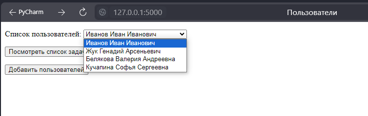
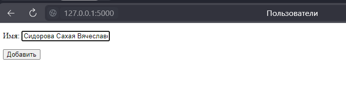
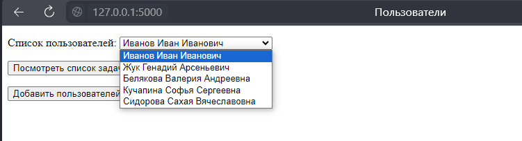
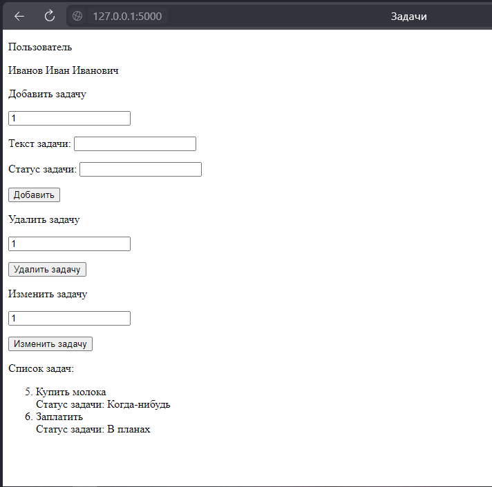
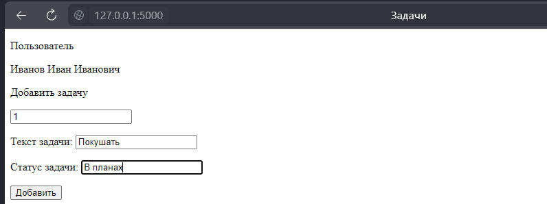
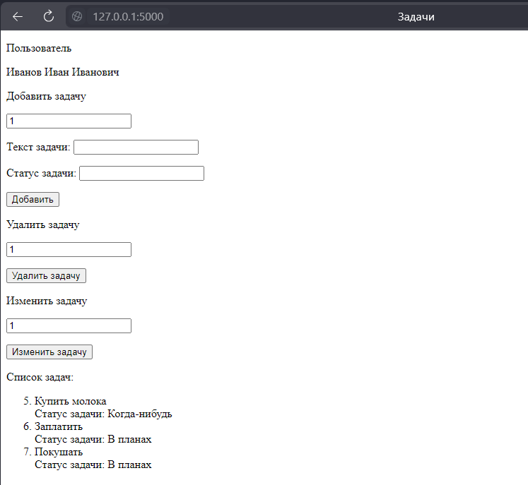
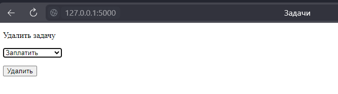
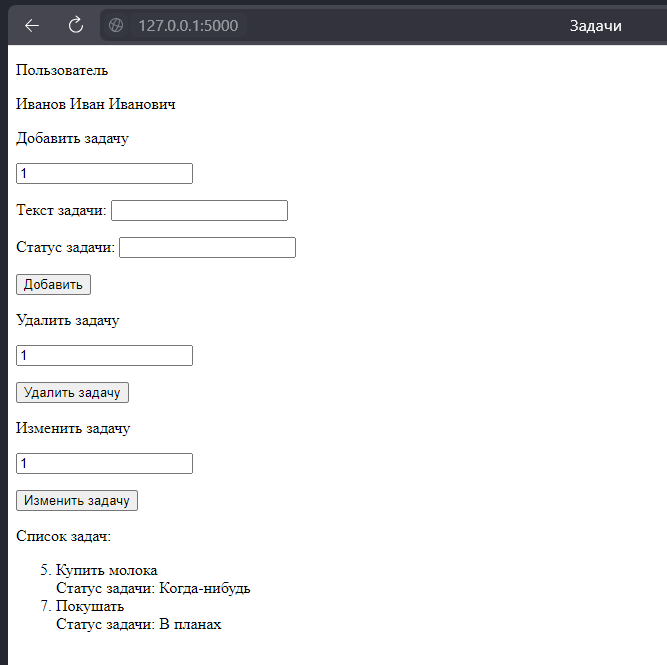
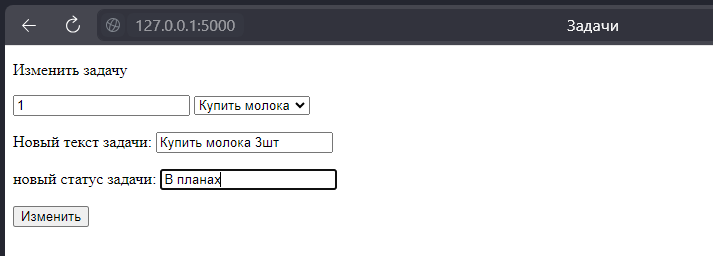
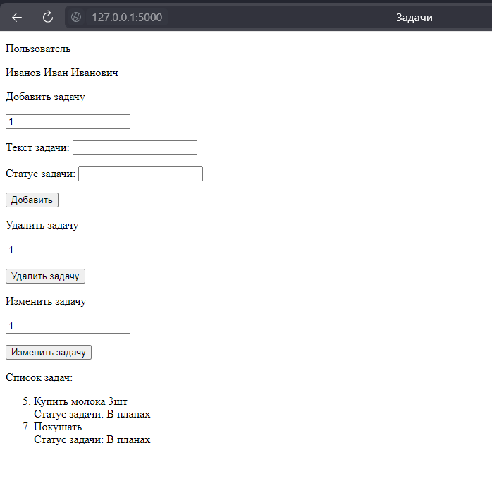

Необходимо реализовать простое web-приложение, позволяющее управлять личным списком задач (TODO-лист) посредством простого Rest API (json). 

**Необходимо реализовать методы:**
- [x]  добавление пользователя - POST /user,
- [x]  получить список задач пользователя - GET /todo (если пользователя не существует, то возвращать 4XX код ошибки),
- [x]  добавить задачу пользователя - POST /todo,
- [x]  удалить задачу пользователя - DELETE /todo/{id},
- [x]  обновить задачу пользователя - PUT /todo/{id}.

## БД

База данных состоит из 2 таблиц "Пользователи" и "Задачи"

В таблице "ПОльзователи" реализованы поля:
- credit_card_number (числовое поле являющееся ключем)
- name (текстовое поле)

В таблице "Задачи" реализованы поля:
- id_task (числовое поле являющееся ключем)
- text_task (текстовое поле)
- status (текстовое поле)
- credit_card_number (числовое поле являющееся внешним ключем)

## Релизованые методы

**Добавление пользователя**

Первоначальный список пользователей:

Поле добавления:

Итоговый список:

Код:

    @app.route('/user', methods=['post'])    
    def add_user2():    
        conn = sqlite3.connect("ToDoYou.db")
        cur = conn.cursor()
        name_us = request.values.get('user_name')
    
        cur.execute(f"INSERT INTO user (name) VALUES('{name_us}')")
    
        conn.commit()
    
        return redirect(url_for("index"))

**Получить список задач пользователя**

Список задач:

Код:

    @app.route('/todo', methods=['get'])
    def get_tasks():
        conn = sqlite3.connect("ToDoYou.db")
        cur = conn.cursor()
        user_us = request.values.get('name_us')
    
        cur.execute(f"SELECT name FROM user WHERE credit_card_number = '{user_us}'")
        name_sql = cur.fetchall()
        if not name_sql:
            raise ValueError("Такого пользователя нет 4XX")
    
        cur.execute(f"SELECT id_task, text_task, status FROM task WHERE credit_card_number = '{user_us}'")
    
        list_task = cur.fetchall()
        return render_template(
            'todo.html',
            tasks_list=list_task,
            name_user=name_sql[0][0],
            user_credit=user_us,
            len=len
        )

**Добавить задачу пользователя**

Добавляемая задача:

Результат:

Код:

    @app.route('/todo', methods=['post'])
    def add_tasks():
        conn = sqlite3.connect("ToDoYou.db")
        cur = conn.cursor()
        text_tasks = request.values.get('task_text')
        status_tasks = request.values.get('task_status')
        credit_tasks = request.values.get('credit')
    
        cur.execute("""INSERT INTO task(text_task, status, credit_card_number) VALUES(:text_t, :status_t, :credit);""",
                    {"text_t": text_tasks, "status_t": status_tasks, "credit": credit_tasks})
    
        conn.commit()
        conn.close()
        return redirect(url_for("index"))

**Удалить задачу пользователя**

Удаляемая задача:

Результат:

Код:

    @app.route('/delete_task', methods=['post'])
    def remove_task():
        conn = sqlite3.connect("ToDoYou.db")
        cur = conn.cursor()
        task_id = request.values.get('task_num')
    
        cur.execute(f"DELETE FROM task where id_task = '{task_id}'")
    
        conn.commit()
        return redirect(url_for("index"))

**Обновить задачу пользователя**

Новая задача:

Результат:

Код:

    @app.route('/update_task', methods=['post'])
    def post_update_task():
        conn = sqlite3.connect("ToDoYou.db")
        cur = conn.cursor()
        task_id = request.values.get('task_num')
        new_task_text=request.values.get('task_text')
        new_task_status=request.values.get('task_status')
    
        cur.execute(f"UPDATE task SET text_task='{new_task_text}', status='{new_task_status}' where id_task = '{task_id}'")
    
        conn.commit()
        return redirect(url_for("index"))
